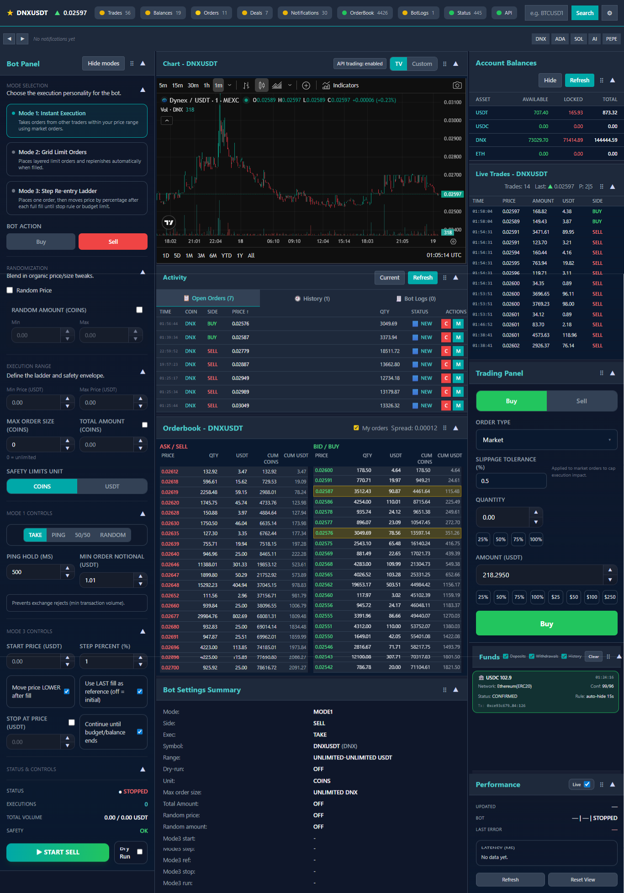
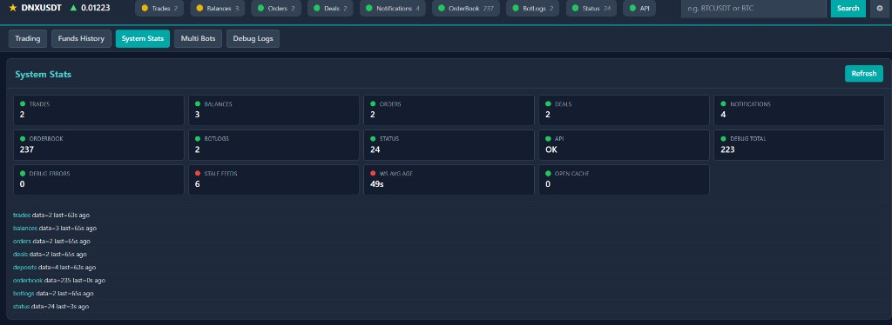
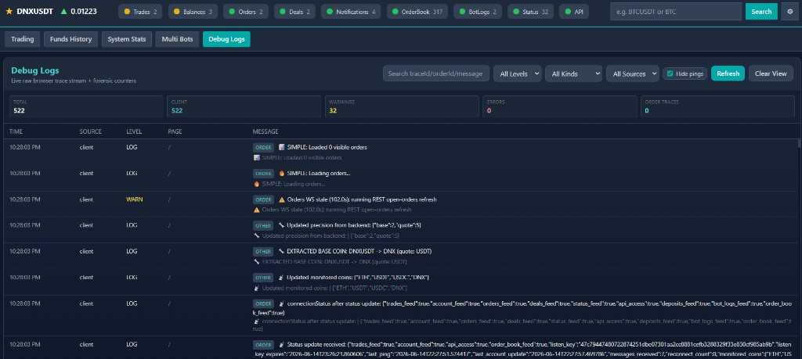

# MEXC Trading Dashboard + Spot Bot

Self-hosted **MEXC spot trading console** — live order book, trade tape, balances, open orders, fill history, deposit notifications, manual order buttons, and a two-mode trading bot in one browser dashboard. Active traders and bot operators who need **book, tape, balances, open orders, and automation on one screen** run it locally (or in Docker on a host they control); API keys stay on the machine and traffic goes outbound to MEXC only — no shared SaaS layer.

## Tech stack

| Layer | Technologies |
|-------|--------------|
| Backend | Python 3, FastAPI, uvicorn, `bot_engine.py` |
| Frontend | HTML, CSS, vanilla JavaScript (`mexc_trading_app.html`, `mexc_trading_app.js`) |
| Exchange | MEXC Spot V3 REST + protobuf WebSocket (`generated_proto/`) |
| Streams | Public depth/trades, private listen-key (balances, orders, deals) |
| Resilience | REST reconciliation when WebSocket feeds go stale |
| Storage | SQLite under `data/` for runtime history |
| Deployment | `./run_server.sh` or optional Docker on the same host |

## Trading workspace

The **Trading** tab is the primary screen: searchable symbol picker, live order book with spread, trades tape, ticker context, and panels for balances, open orders, and manual buy/sell buttons. Change pair and the server unsubscribes the old symbol so public depth and private account streams do not cross-contaminate.

Optional highlighting shows where your resting orders sit in the book. WebSocket endpoints fan out from server-side MEXC connections; account updates arrive on the private listen-key stream with REST reconciliation when a feed goes stale.

## Manual order execution

Place, cancel, and modify limit orders from the UI. Exchange precision, min-notional checks, and quantity rounding happen server-side before an order hits the wire. When a WebSocket frame is delayed, REST refresh backfills open orders so the panel matches reality before you click again.

## Funds history

The **Funds History** tab tracks deposits, withdrawals, and balance movements over time — useful when a bot or manual session ends and you need to reconcile what moved without exporting CSV from the exchange UI.

## Bot modes (MODE1 and MODE2)

| Mode | Behavior |
|------|----------|
| **MODE1** | Book-reactive — when price enters your band, fires **limit IOC** orders (no resting liquidity left behind) |
| **MODE2** | Grid-style limit orders within a configured range with a monitoring loop |

Dry-run mode lets you validate band logic without sending real orders. Presets save and load band parameters, sizes, and mode settings. Connection health indicators in the header show which feeds (trades, balances, orders, order book, bot logs) are live and how old the last update is.

For the full **MODE1–MODE5** suite with multi-bot profiles, see [mexc-trading-dashboard-bot-suite-overview](https://github.com/logicencoder/mexc-trading-dashboard-bot-suite-overview).

## Multi Bots panel

The **Multi Bots** tab exposes bot instance controls when more than one profile is configured (single-bot deployments still use the same layout). Start/stop, mode selection, and status for each instance stay adjacent to the trading panels so you are not alt-tabbing between tools.

## System Stats

The **System Stats** tab is the feed-health dashboard: per-stream counters, stale-feed warnings, WebSocket age, REST fallback indicators, debug totals, and last-update timestamps for trades, balances, orders, deals, order book, bot logs, and API status. When a private stream stops updating, the UI shows age in seconds and may trigger REST refresh automatically.

## Debug Logs

The **Debug Logs** tab is a searchable, filterable event table: timestamp, source, level, page, and message. Filter by level, kind, or source; hide ping noise; search by trace ID, order ID, or free text. Client-side order traces, precision updates, monitored coin lists, and WS stale warnings land here — equivalent to opening devtools on every panel at once.

The UI posts structured client events to `POST /api/client-logs` so operators can share a session log after an incident without screen recording.

Private code: [mexc_trading_app](https://github.com/logicencoder/mexc_trading_app)

See [REPOS.md](REPOS.md).

---

**Made by [Logic Encoder](https://logicencoder.com)** · [GitHub](https://github.com/logicencoder) · [Contact](https://logicencoder.com/contact/)
