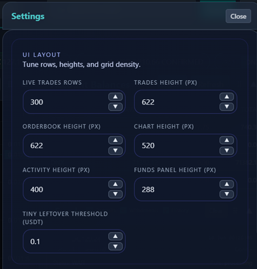
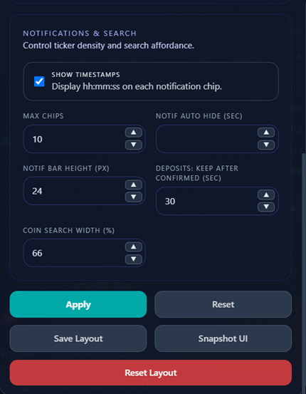
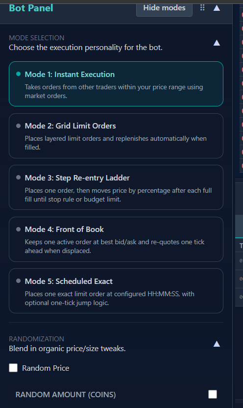
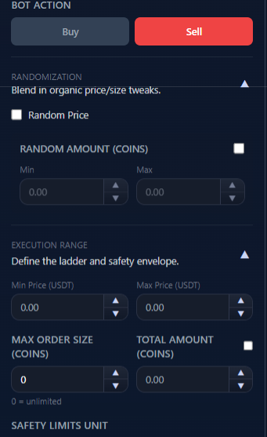
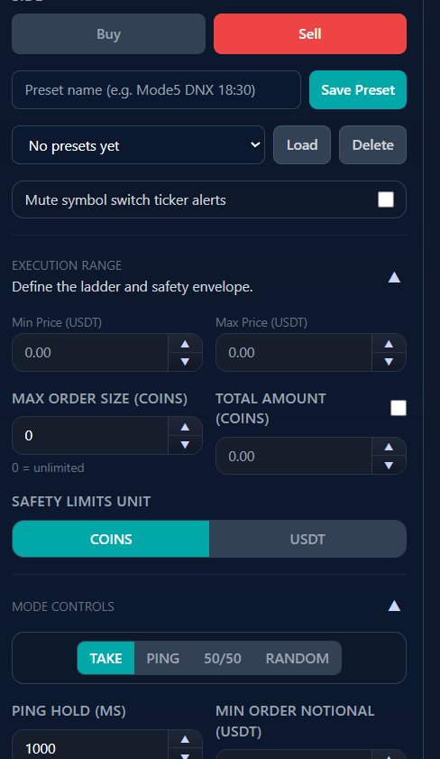
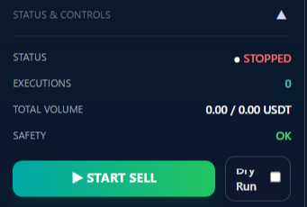
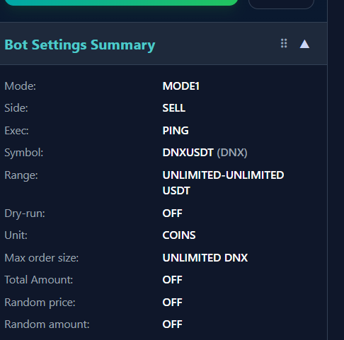
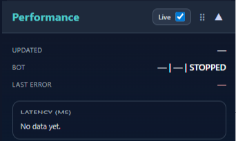
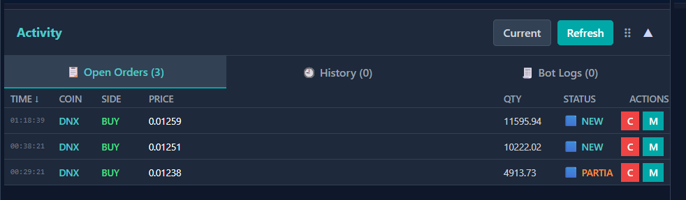

# MEXC Trading Dashboard + Spot Bot

The goal was a **complete trading layout built from scratch**, with every panel placed and sized the way one operator actually works. Book, tape, balances, open orders, manual buttons, bot controls, and latency readouts on **one screen** — so depth, open orders, and balances stay visible when volume moves and you need to cancel, modify, or re-quote immediately.

The retail exchange layout never fit that workflow: too **small**, too **fixed**, too **slow** for someone who cares about reaction time. Building this meant iterating on **speed and stability** — fast protobuf WebSocket feeds, REST backfill when a private stream stalls, symbol-switch hygiene so old frames never paint the wrong market, asyncio bot paths, and a **Performance** panel that measures `place_order`, `order_ws_latency_ms`, and related timings.

The grid is **fully yours**: panels **collapse**, **drag** to reorder within each column, **resize** by pixel, tune row counts and heights in **Settings**, then **Save Layout** or **Snapshot UI** so you do not rebuild the desk every session. **MODE1–MODE5** automation, manual **Trading** buttons, **Activity → Open orders** with per-row **C** / **M**, and feed-health LEDs stay on the same view — because that is why it was built. Self-hosted on hardware you control; API keys stay local; traffic goes outbound to MEXC only.

**Typical flows:** market-make a thin pair → **MODE4** front-of-book re-quote while watching **Order book** + feed LEDs. React to shown liquidity → **MODE1** with min/max band + **dry run** first, then live **TAKE** or **PING**. Scale in with limits → **MODE3 Step Re-entry Ladder** after each full fill. One timed entry → **MODE5** arm **HH:MM:SS** with optional one-tick jump. Manual override → **Trading** panel limit/market with **25/50/75/100%** shortcuts. Tune the grid once → **Settings → Save Layout**. Something looks dead → **System Stats** for stale feed age → **Debug Logs** filtered by `order` or `perf`. Run two strategies → **Multi Bots** profiles on different symbols concurrently.

## Tech stack

| Layer | Technologies |
|-------|--------------|
| Backend | Python 3, FastAPI, uvicorn, asyncio worker queues |
| Bot engine | MODE1–MODE5 automation profiles, multi-bot registry, perf metrics |
| Frontend | HTML, CSS (Tailwind-style dark UI), vanilla JavaScript |
| Exchange | MEXC Spot V3 REST + protobuf WebSocket |
| Public streams | Aggregated deals, limit depth order book |
| Private streams | Listen-key account, orders, deals; deposit poll + WS queue |
| Persistence | SQLite for funds events, deals, and bot log history |
| Diagnostics | System Stats and Debug Logs tabs, client log ingest, Performance panel |
| Deployment | Shell launcher or optional Docker on the same host |

## Speed-first single-screen layout

When best bid/ask shifts or volume prints spike, you need updated depth, your row in **Open orders**, and **C** / **M** / **Refresh** on the same view. **Reaction time is the product** — book, orders, and balances stay together instead of scattered across browser tabs.

| Capability | How the dashboard delivers it |
|------------|--------------------------------|
| Book, orders, balances together | One grid: **Order book**, **Activity → Open orders**, **Account balances**, **Live trades** visible at once |
| Fresh depth after symbol change | Hard unsubscribe/resubscribe + anti-crossfeed; **System Stats** shows per-feed **last data age** |
| Order placement feedback | **Performance** panel: `place_order` REST ms, `order_ws_latency_ms`, `order_first_render_ms`, order trace ids in **Debug Logs** |
| Bot automation on the same desk | **Bot panel** MODE1–MODE5 beside the book you automate against |
| Persistent custom layout | Drag/collapse/resize panels; **Settings** heights; **Save Layout** persists your stack |

**Bot modes tied to book speed:** **MODE3 — Step Re-entry Ladder** (product name) places the next limit **Step Percent** away after each full fill. **MODE4 — Front of Book** re-quotes on **Poll Seconds** when your quote is no longer at best bid/ask. **MODE1** **PING/TAKE** fires inside your min/max band with **Ping Hold (ms)** between hits. **Manual path:** **Activity → Open orders** — **C** cancel, **M** modify, **Refresh** when the orders WebSocket stalls; no exchange submenu.

**Example:** front-of-book quote gets jumped → watch **Order book** update in the same second as **Bot logs**; open **Performance → Live** and confirm `place_order` and `order_ws_latency_ms` stay in a range you accept before sizing up.

## Custom layout — drag, collapse, resize, persist

The **Trading** workspace is a three-column grid (`leftColumn`, `centerColumn`, `rightColumn`). Every major panel — **Bot Panel**, **Bot Settings Summary**, **Performance**, **Trading Panel**, **Chart**, **Order book**, **Activity**, **Account balances**, **Live trades**, **Funds** — has:

- **Collapse** (▲/▼) to hide body content without losing the header strip.
- **Drag handle** (⠿) to reorder panels within a column stack; order persists in `localStorage`.
- **Height resize** on stack panels (trades, order book, chart, activity, funds) via bottom-edge drag; heights sync to Settings numeric fields.

**Settings → Save Layout** writes panel order, collapse state, and heights. **Reset Layout** restores factory panel arrangement. **Snapshot UI** exports a JSON snapshot of the current layout + key UI toggles for sharing or backup. **Apply** / **Reset** in Settings only touch numeric/checkbox fields in the overlay (heights, rows, notification bar, bot-related thresholds) without wiping drag order unless you hit **Reset Layout**.

**Example:** you want the **Order book** taller during a volatile session → drag the panel edge or raise **Orderbook Height (px)** in Settings → **Apply** → **Save Layout**. Next browser refresh keeps the same stack order and heights.

## Settings menu — every control

Open **⚙ Settings** in the top bar. The overlay has two sections plus action buttons at the bottom.

### UI Layout

Tune row counts, panel heights, and bot-related thresholds stored in `uiSettings` (`localStorage`):

| Control | ID / range | What it does |
|---------|------------|--------------|
| **Live Trades Rows** | `uiTradesRows`, 1–500 | Max rows buffered in the public trade tape (also drives scroll depth). |
| **Trades Height (px)** | `uiTradesHeight`, 140–2000 | Pixel height of the **Live trades** panel. |
| **Orderbook Height (px)** | `uiOrderBookHeight`, 140–2000 | Pixel height of the dual-sided **Order book** panel. |
| **Chart Height (px)** | `uiChartHeight`, 200–2500 | TradingView / Custom chart viewport. |
| **Activity Height (px)** | `uiActivityHeight`, 140–2000 | Open orders / History / Bot logs stack. |
| **Funds Panel Height (px)** | `uiFundsHeight`, 160–2000 | Deposit/withdrawal notification stack on the right column. |
| **Tiny Leftover Threshold (USDT)** | `uiTinyLeftoverUSDT`, 0–1000 | Orders below this notional can be auto-cancelled as dust (0 = off). |
| **Ping Hold (ms)** | `uiPingHoldMs`, 0–60000 | MODE1 **PING** style pause between fills (also sent to bot on start). |
| **Min Order Notional (USDT)** | `uiMinOrderNotionalUSDT`, 0–1M | Exchange min-notional guard; bot skips sub-threshold sizes. |

### Notifications & Search

| Control | ID / range | What it does |
|---------|------------|--------------|
| **Show Timestamps** | `uiNotifShowTimestamp` | Append `hh:mm:ss` on each notification chip in the top ticker. |
| **Max Chips** | `uiNotifMaxItems`, 1–200 | Visible chips in the scrollable notification bar (`notifSettings.maxItems`). |
| **Notif Auto Hide (sec)** | `uiNotifTtlSeconds`, 0–86400 | TTL for ticker chips (0 = never auto-hide). |
| **Notif Bar Height (px)** | `uiNotifBarHeight`, 18–60 | Vertical size of the notification strip (live-updates on input). |
| **Deposits: Keep After Confirmed (sec)** | `uiDepositConfirmedKeepSec`, 0–86400 | How long confirmed deposit cards stay in the **Funds** stack. |
| **Coin Search Width (%)** | `uiCoinSearchWidthPct`, 20–90 | Width of the symbol search field in the top bar. |

**Apply** saves `uiSettings` + `notifSettings` fields above and reapplies heights immediately. **Reset** reloads defaults for those fields only.

Additional notification filters live on the **Funds** panel header (not inside Settings): **Deposits**, **Withdrawals**, and **History** toggles (`fundsTickerDepositsToggle`, `fundsTickerWithdrawalsToggle`, `fundsTickerHistoryToggle`) control which fund events appear in the ticker and stack. **Clear** wipes the visible funds list. Bot log and connection noise in the ticker is gated by `notifSettings.includeBotLogs` and `includeConnections` (defaults off) — persisted separately in `localStorage`.

## Top bar — symbol, health, and alerts

The header stays visible on every workspace tab:

- **Live symbol** with last price and direction arrow; **symbol input** normalizes pairs (e.g. `DNX` → `DNXUSDT`) and switches the active market so public and private feeds unsubscribe the old pair before subscribing the new one.
- **Feed LEDs** — trades, balances, orders, deals, deposits (notification count), order book, bot logs, status WebSocket, and REST API — each with a message counter so you see which pipe is alive without opening logs.
- **Favorites** — star the active pair; up to five quick-switch buttons in the notification bar.
- **Notification ticker** — scrollable bar with ◀/▶ stepping; honors Max Chips, TTL, timestamp toggle, and funds/bot/connection filters above.
- **Settings** — layout and notification controls documented in the previous section.

**Example:** you switched from `BTCUSDT` to `DNXUSDT` but the tape still shows old prints — check **msgTrades** and **order book** LED counters; if frozen, confirm symbol input applied and watch counters reset after resubscribe. Stale **orders** LED → open **Activity → Open orders** and hit REST refresh while **System Stats** shows orders feed age climbing.

## Bot panel — complete control reference

The left **Bot** column is the automation control center. Subsections collapse independently (Mode Selection, Randomization, Bot Action, Execution Range, Mode Controls, Status & Controls). **Hide modes** collapses the five mode cards while keeping the rest of the panel usable.

### Mode selection (MODE1–MODE5)

| Mode | Engine behavior |
|------|-----------------|
| **MODE1 — Instant execution** | Watches live depth inside min/max band; fires **limit IOC** when liquidity appears (no resting quote). **Execution style:** **TAKE** (cross spread), **PING** (join level + hold), **50/50 ALTERNATE**, or **RANDOM** between TAKE/PING. **Ping Hold (ms)** pauses between fills. **Min Order Notional (USDT)** blocks exchange rejects. Built-in **cooldown** (~1s) and stuck-order recovery if cancel fails. |
| **MODE2 — Grid limit orders** | Places one limit inside the band; **replenishes after each fill**. Optional **Random Price** picks a level within range. Uses same min/max, size caps, and budget guards as MODE1. |
| **MODE3 — Step re-entry ladder** | One resting limit at a time. After each **full fill**, next price moves by **Step Percent (%)** from **Start Price** or last fill (**Use LAST fill as reference**). **Move price LOWER after fill** flips direction. Optional **Stop At Price** halts the step sequence. **Continue until budget/balance ends** vs stop at stop price. |
| **MODE4 — Front of book** | Keeps **one limit at best bid/ask** plus **Jump Ticks** offset. **Re-quote when displaced** + **Poll Seconds** loop moves the quote when knocked off the front. |
| **MODE5 — Scheduled exact** | Arms a **single limit at HH:MM:SS** with **Exact Price** and **Exact Quantity** (0 = auto from balance rules). Live **Countdown** + side/unit readout. **If someone ahead, jump one tick** uses top-of-book before submit. One shot per start (`_mode5_placed`). |

Switching mode shows/hides **Mode Controls** and toggles which range fields apply (MODE5 hides classic min/max band UI when only exact price/qty matter).

### Randomization

- **Random Price** — MODE1/2 pick non-deterministic prices inside the band (MODE1 book-level selection upstream).
- **Random Amount (COINS)** — enable + **Min** / **Max** coin range per execution when you want size variation.

### Bot action

- **Side** — **Buy** / **Sell** tabs; start button label follows (`▶ Start Bot` / `▶ START BUY` / `▶ START SELL`).
- **Presets** — name field + **Save Preset** / **Load** / **Delete**; full bot JSON in `localStorage` (`botPanelPresets`).
- **Mute symbol switch ticker alerts** — suppresses noisy alerts when changing pair (`quietSymbolSwitchAlerts`).

### Execution range (shared safety envelope)

| Control | Behavior |
|---------|----------|
| **Min Price / Max Price (USDT)** | Band for MODE1/2/3/4 book logic. |
| **Max Order Size (COINS)** | Per-order cap; **0 = unlimited**. |
| **Total Amount** + enable checkbox | Budget cap in coins or USDT (`max_sum_use`); triggers **safety halt** when exhausted. |
| **Safety Limits Unit** | **COINS** vs **USDT** toggle for budget accounting. |

### Mode-specific controls (visible per selected mode)

**MODE1:** **TAKE / PING / 50/50 / RANDOM** style row; **Ping Hold (ms)**; **Min Order Notional (USDT)** with helper text about exchange min volume.

**MODE3:** **Start Price**, **Step Percent (%)**, **Move price LOWER after fill**, **Use LAST fill as reference**, **Stop At Price** (+ enable), **Continue until budget/balance ends**.

**MODE4:** **Re-quote when displaced**, **Poll Seconds**, **Jump Ticks**.

**MODE5:** live **Side / Unit / Countdown** readouts; **Time (HH:MM:SS)**, **Exact Price**, **Exact Quantity (0=auto)**, **If someone ahead, jump one tick**.

### Status & controls

- **Status** — RUNNING / STOPPED with color indicator.
- **Executions** — fill counter for the session.
- **Total Volume** — spent base + USDT notional vs budget.
- **Safety** — OK or halt reason when budget/limit hit.
- **▶ Start Bot** / **■ Stop Bot** — REST start/stop; dry-run checkbox locked while running (`botDryRunRunning`).
- **Dry Run** — simulates decisions without sending signed orders.

**Example:** test a new band without risk → enable **Dry Run**, pick **MODE1**, set min/max around the current book, choose **PING** + **Ping Hold 500**, start bot, read lines in **Activity → Bot logs**. Ready for live → disable dry run, enable **Total Amount** in USDT, watch **Safety** flip to halt if budget hits zero mid-session.

## Bot Settings Summary panel

Read-only card listing the effective config the server will receive: mode, side, execution style, symbol, price band, dry-run flag, unit, max order size, total budget, random flags, and mode-specific fields. Updates when you change any bot control or load a preset — use it as a pre-flight checklist before **Start Bot**.

## Performance panel — trade and bot latency

The **Performance** panel (draggable, collapsible) tracks **how fast the stack reacts** — REST place latency, WebSocket order events, and first render timing:

- **Live** toggle — when on, polls `/api/bot/perf` every second; when off, manual **Refresh** only.
- **Updated** — timestamp of last successful perf payload.
- **Bot** — `symbol | MODE | RUNNING/STOPPED`.
- **Last Error** — most recent bot engine error string.
- **Latency (ms)** table — backend metrics from `get_perf_metrics()` with `count`, `last`, `avg`, `min`, `max` per key:

| Backend metric key | Measured operation |
|--------------------|-------------------|
| `place_order` | Signed REST place round-trip |
| `mode1_finalize` | MODE1 post-fill finalize path |
| `signed_get` | Signed GET helper latency |
| `update_counters_from_order` | Budget/volume counter update from order WS |

Appended below (client-side, no backend required):

| Client metric key | Measured operation |
|-------------------|-------------------|
| `order_ws_latency_ms` | Time from place response to first private order WS update |
| `order_first_update_ms` | First WS update after submit |
| `order_first_render_ms` | First DOM render of the new/changed order row |
| `order_final_elapsed_ms` | End-to-end trace until terminal order state |

**Refresh** forces a fetch; **Reset View** clears the displayed table without wiping server counters. Order traces also log to **Debug Logs** (`kind=order`, `perf`) with searchable `traceId`.

**Example:** MODE4 re-quotes feel sluggish → enable **Live**, fire one manual limit from **Trading**, watch `place_order` vs `order_ws_latency_ms`. High REST but low WS → network or MEXC API; high WS but high `order_first_render_ms` → UI path; cross-check **Debug Logs** filtered by `perf`.

## Trading panel — manual orders

Manual **Buy/Sell** with limit or market type, price and quantity spinners, **25/50/75/100%** balance shortcuts, quote/base preset buttons ($25–$250 / 0.1–1 coin on market amount group), market **slippage tolerance**, server-side precision and min-notional checks, and REST refresh when the orders WebSocket goes stale.

**Example:** quick scale-out → **Sell**, **market**, **100%** base balance with slippage tolerance set; confirm fill in **Activity → History** and the notification ticker before starting **MODE2** on the other side.

## Chart panel

**TradingView** embed or **Custom** placeholder chart tied to the active symbol; **API trading: enabled** badge from exchange filters; **TV / Custom** toggle.

## Order book

Dual-sided depth (asks/bids) with cumulative coins and USDT, spread line, sortable price columns, optional **highlight my resting orders**, live protobuf depth feed.

**Example:** running **MODE4** — watch your quote line stay at best bid/ask; when displaced by one tick, bot log should show a **re-quote** event while the book panel updates in the same second.

## Activity panel

Three sub-tabs in one stack — all on the same panel so you never leave the book to manage resting liquidity:

- **Open orders** — sortable table (Time, Coin, Side, Price, Qty, Status); **Current** vs all-symbol filter; **Refresh** REST backfill; per-row **C** cancel and **M** modify when the book moved but the orders feed lagged.
- **History** — closed/canceled fills for the session; **Refresh** reloads from REST if the tab shows a load error.
- **Bot logs** — streaming lines while a bot runs (SQLite-backed server-side); export for post-mortems.

**Example:** bot says order placed but nothing on book → **Open orders** with **all symbols** off, hit refresh; if still empty, filter **Debug Logs** by `order` trace id from the bot log line.

## Account balances

Available, locked, and total per asset for monitored base/quote coins; privacy hide toggle and manual balance refresh.

## Live trades tape

Public agg-deals stream: time, price, amount, USDT notional, side; trade count and last-price arrow in the panel header; row count governed by **Live Trades Rows** in Settings.

## Funds notification stack

Right-column **Funds** panel lists pending/confirmed deposits and withdrawals with asset, network, amount, and status chips. Header toggles filter what reaches the top ticker. **Clear** removes visible cards; confirmed items respect **Deposits: Keep After Confirmed** from Settings.

## Funds History workspace

Separate tab — **Funds Full History** from SQLite: deposits and withdrawals with asset, status, amount, network, tx id, and timestamp. Filter by kind (all / deposit / withdrawal) and asset code; complements the live deposit notification stream in the top bar.

**Example:** deposit hit the ticker but you need tx id for accounting → **Funds History**, filter **deposit**, copy network and tx fields; cross-check live **deposits** LED counter kept incrementing during the transfer.

## System Stats workspace

Feed-health dashboard for incident triage — per-stream message totals, stale-feed count, average WebSocket age, API OK/OFF, debug log totals/errors, open-order cache size, and a per-feed **last data age** breakdown. Drives the same stale detection that triggers REST open-order refresh in the UI.

**Example:** bot stopped firing **MODE1** but LEDs look green → **System Stats** → if **order book** last age is high while trades age is low, the book feed stalled even though tape runs; restart symbol switch or server before blaming bot config.

## Multi Bots workspace

**Multi Bot Profiles** — save named profiles (profile name, symbol, MODE1–MODE5, optional note) in the browser (`multiBotProfiles`), then **start/stop each profile independently** with its own `bot_id`. Run different modes on different symbols concurrently without overwriting the main Bot panel scratch config.

**Example:** **MODE4** on `DNXUSDT` while **MODE2** grid runs on another pair — save each as a profile, start both from **Multi Bots**; main **Bot** panel stays your sandbox for the active symbol.

## Debug Logs workspace

Searchable forensic stream from the debug WebSocket and client log batching (`/api/client-logs` mirror):

- **Search** — trace id, order id, or plain-text query.
- **Level** — All / ERROR / WARN / INFO / LOG / DEBUG.
- **Kind** — order, balance, bot, orderbook, funds, ws, **perf**, ui, other.
- **Source** — client, server, bot.
- **Hide pings** — suppress WS keepalive noise (default on).
- Counter strip — total, client, warnings, errors, order traces.
- **Refresh** / **Clear View** — reload or wipe the on-screen buffer (server log file retained).

**Example:** missed fill → search order id from **Activity → History**; open matching **order** kind lines, follow trace id into **bot** kind if automation was running; export bot logs from **Activity** if you need a file attachment.

## Reliability behaviors

- **Symbol switch** — unsubscribes old public depth/trades and rebinds private streams; anti-crossfeed ignores late frames from the previous symbol.
- **Stale private feeds** — UI shows age in seconds; orders panel may run REST open-order refresh when the orders WebSocket stops updating.
- **MEXC compliance** — client PING every 15s, listen-key extend, proactive WS rotate before 24h cap, signed REST orders with query-in-URL body pattern.
- **Tiny leftover auto-cancel** — sub-threshold open orders on the active symbol can be cancelled when **Tiny Leftover Threshold (USDT)** is set in Settings.

Private code: [mexc_trading_app](https://github.com/logicencoder/mexc_trading_app)

See [REPOS.md](REPOS.md).

---

**Made by [Logic Encoder](https://logicencoder.com)** · [GitHub](https://github.com/logicencoder) · [Contact](https://logicencoder.com/contact/)
